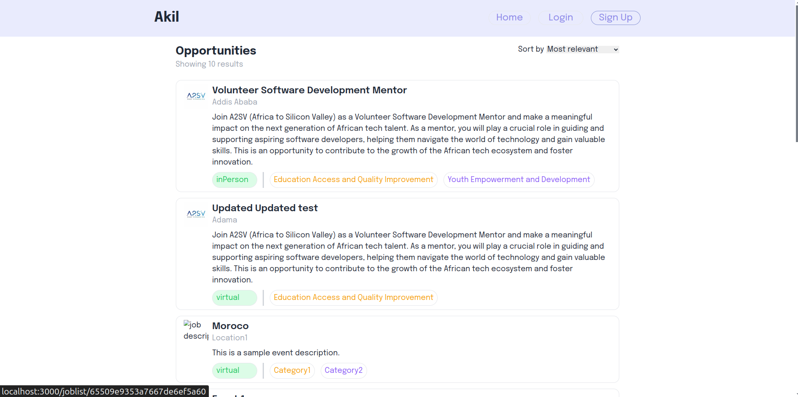
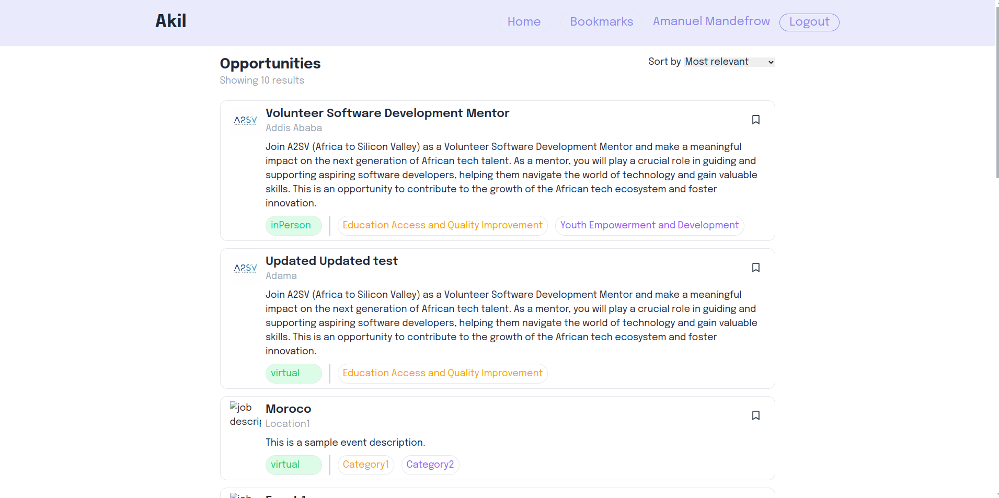
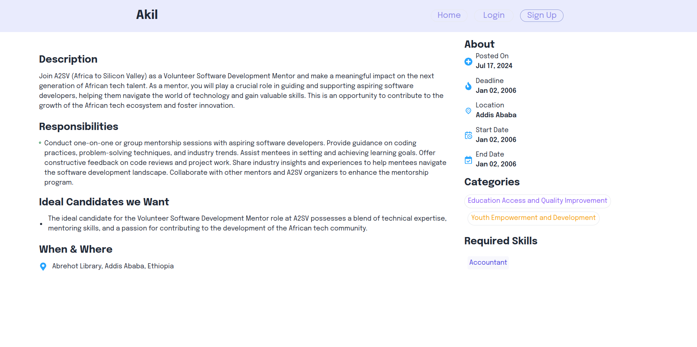
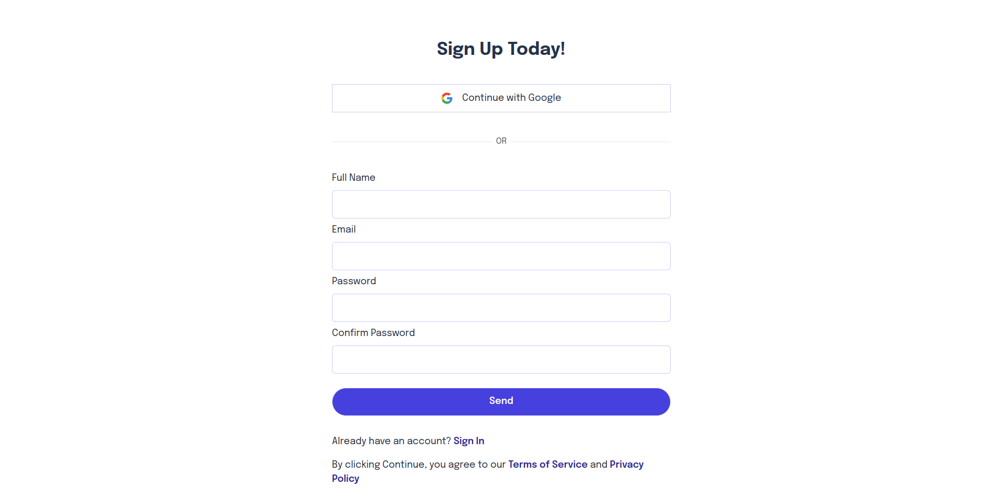
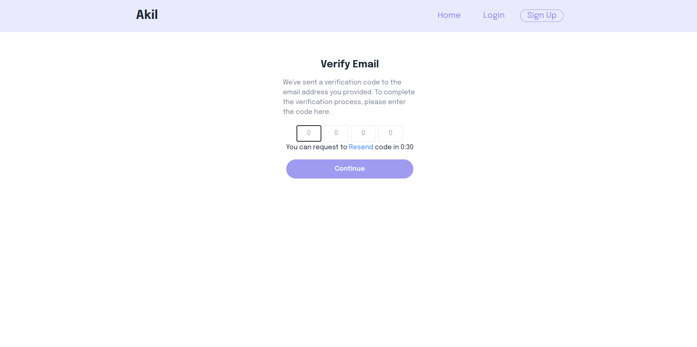
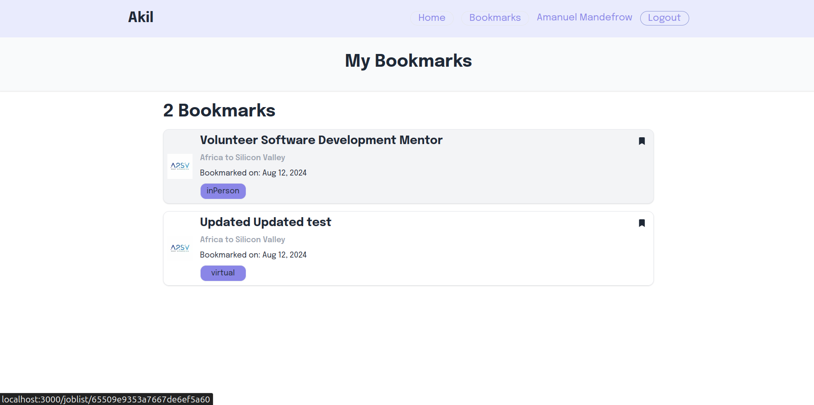

# Job Listings Web Application

This is a web application for browsing job listings, implemented with Next.js and Tailwind CSS. Users can view all available job opportunities, sort them by relevance or deadline, view detailed information about each job, and bookmark jobs for later access. The application also supports user authentication with NextAuth.js, providing signup, OTP, and login pages.

## Features

- **Display all job listings:** Users can view a list of all job opportunities.
- **Sort job listings:** Sort jobs by most relevant, nearest deadline, or farthest deadline.
- **View detailed job information:** Detailed descriptions and requirements for each job are available.
- **Bookmark jobs:** Users can bookmark jobs to save them for later. This feature is accessible only to authenticated users.
- **User authentication with NextAuth.js:**
  - Signup page
  - OTP verification page
  - Login page
- **Testing:**
  - Jest testing for unit tests
  - Cypress testing for end-to-end tests

## Screenshots

### All Jobs Rendered (Unauthenticated - Without Bookmark Icon)


### All Jobs Rendered (Authenticated - With Bookmark Icon)



### Job Details Page


### Signup Page


### OTP Page


### Login Page


### Bookmarked Jobs Page


## Installation

1. Clone the repository:
    ```sh
    git clone https://github.com/amanuelmandefro3/job_list.git
    ```
2. Navigate to the project directory:
    ```sh
    cd job-listings
    ```
3. Install the dependencies:
    ```sh
    npm install
    ```

## Usage

1. Start the development server:
    ```sh
    npm run dev
    ```
2. Open your browser and navigate to `http://localhost:3000`.

## Code Structure

- `app/joblist/page.tsx`: The main page displaying the job listings and sorting functionality.
- `data/jobs.json`: The JSON file containing the job data (used when the project is started).
- `public/images`: The directory containing job-related images.
- `app/bookmarks/page.tsx`: The bookmarks page displaying saved jobs (only accessible to authenticated users).
- `app/auth/signup.tsx`: The signup page for user registration.
- `app/auth/otp.tsx`: The OTP verification page.
- `app/api/auth/signi.tsx`: The login page for user authentication.
